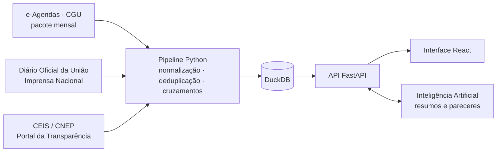

# Antessala — auditoria cívica das reuniões entre setor privado e Governo Federal

[](LICENSE)
[](https://dados.gov.br)
[](backend_python/)
[](frontend/)

**Acesse:** https://antessala.greca.dev.br  ·  **Vídeo de apresentação:** [youtube.com/watch?v=M0sWB8w8hs8](https://www.youtube.com/watch?v=M0sWB8w8hs8)

[](https://www.youtube.com/watch?v=M0sWB8w8hs8)

> Iniciativa independente de controle social, submetida ao **2º Concurso de Reúso de Dados Abertos da Controladoria-Geral da União (Edital CGU nº 46/2026)**.
> Não é um sistema oficial da CGU. Autoria: **Aislan Greca** · contato: `robodoaislan@greca.dev.br`

---

## O problema

Desde o Decreto nº 10.889/2021, autoridades do Executivo Federal publicam no **e-Agendas** as reuniões que têm com representantes de interesses privados. É um avanço de transparência, mas o volume torna o controle social impraticável: são centenas de milhares de participações registradas, e o que acontece *depois* dessas reuniões é publicado em outro lugar — o **Diário Oficial da União**.

Ninguém consegue verificar à mão se uma empresa que esteve num gabinete recebeu, semanas depois, um contrato, uma autorização ou uma resolução daquele mesmo órgão. Nem se ela estava, naquele momento, impedida de contratar com a administração.

## O que o Antessala faz

Cruza automaticamente três fontes oficiais de dados abertos e apresenta o resultado de forma navegável:

| Pergunta | Cruzamento |
|---|---|
| Uma empresa recebeu algo do órgão que visitou, pouco depois da visita? | e-Agendas × Diário Oficial da União |
| Uma empresa impedida de contratar esteve em reunião durante a vigência da sanção? | e-Agendas × CEIS/CNEP |
| O ato publicado trata do mesmo assunto que a reunião declarou? | Leitura assistida por Inteligência Artificial |
| A pauta declarada informa o cidadão, ou é genérica? | Classificação de opacidade das pautas |
| Quem circula entre quais gabinetes, representando quem? | Rede de relações (grafo) |

Na interface, o cidadão ou o auditor filtra por período, órgão, entidade, representante ou autoridade; abre o **dossiê** de qualquer representante privado ou autoridade; vê o **ato do DOU com link para a publicação oficial**; e pode exportar os dados (CSV/JSON), imprimir o parecer ou encaminhar uma manifestação à **Fala.BR**.

### Números da base (atualizada em 10/09/2026)

| Indicador | Valor |
|---|---:|
| Participações de agentes privados em reuniões com autoridades | 891.974 |
| Eventos de agenda | 121.891 |
| Autoridades públicas | 6.279 |
| Órgãos do Executivo Federal | 217 |
| Representantes privados | 174.097 |
| Entidades representadas | 67.012 |
| Atos do DOU coletados | 3.818 |
| Sanções CEIS/CNEP | 25.464 |
| Correlações reunião → ato do mesmo órgão (até 60 dias) | 175 (27 críticas) |
| Pares empresa × sanção com reunião dentro do alcance da sanção | 34 |

Reuniões de out/2022 a jul/2026 · atos do DOU de jan/2023 a set/2026. A base é atualizada automaticamente todo dia 10.

---

## Dados abertos utilizados

Requisitos 4.1.4 e 6.3 do edital: todas as fontes são públicas, em formato aberto, e publicadas por órgãos do Governo Federal.

| Conjunto de dados | Publicador | Formato | Uso no projeto | Acesso |
|---|---|---|---|---|
| Agenda de Autoridades (e-Agendas) | CGU | CSV (pacote ZIP) | Base de reuniões, autoridades, representantes e entidades | [gov.br/cgu — dados abertos](https://www.gov.br/cgu/pt-br/acesso-a-informacao/dados-abertos/arquivos/agenda-de-autoridades) · [download direto](https://dadosabertos-download.cgu.gov.br/dados_e-agendas/dados_e-agendas.zip) |
| Diário Oficial da União | Imprensa Nacional | HTML/JSON (consulta pública) | Contratos, inexigibilidades, aditivos, resoluções e autorizações | [in.gov.br/consulta](https://www.in.gov.br/consulta) |
| Cadastro de Empresas Inidôneas e Suspensas (CEIS) | CGU | CSV | Empresas impedidas de contratar | [Portal da Transparência](https://portaldatransparencia.gov.br/download-de-dados/ceis) |
| Cadastro Nacional de Empresas Punidas (CNEP) | CGU | CSV | Empresas punidas pela Lei Anticorrupção | [Portal da Transparência](https://portaldatransparencia.gov.br/download-de-dados/cnep) |

---

## Aderência ao Edital CGU nº 46/2026

### Admissibilidade (item 4)

| Requisito | Situação |
|---|---|
| 4.1.1 Formulário de inscrição | Realizada |
| 4.1.2 Caso de reúso cadastrado no dados.gov.br | A cargo do autor, referenciando os conjuntos acima |
| 4.1.3 Transparência e controle social | Objetivo central: tornar auditável a relação entre reuniões e atos oficiais |
| 4.1.4 Uso e identificação de dados abertos | Quatro conjuntos oficiais, identificados na tabela acima |

### Critérios de julgamento (item 8.2)

| Critério (peso) | Como o projeto responde |
|---|---|
| **Benefício para a sociedade ou economia** (2) | Dá ao cidadão, à imprensa e aos órgãos de controle um instrumento para acompanhar a influência privada sobre decisões públicas, com prova documental (link para o ato no DOU) e caminho direto para manifestação na Fala.BR. |
| **Relevância e impacto** (2) | Cobre todo o Executivo Federal presente no e-Agendas: 217 órgãos, 6.279 autoridades e 891 mil participações, com atualização mensal automática. |
| **Inovação e originalidade** (1) | Cruza e-Agendas, DOU e cadastros de sanção — bases que não se comunicam — e usa Inteligência Artificial com erro medido e declarado na tela, em vez de conclusões opacas. |
| **Apresentação e usabilidade** (1) | Interface web com filtros, dossiês por ator e por autoridade, grafo de relações, treemaps de temas e órgãos, e o Robô Antunes como mediador da leitura. Todo ato citado leva à publicação oficial. |
| **Replicabilidade e escalabilidade** (1) | Código aberto sob licença MIT, implantação por Docker, rotina mensal versionada e fontes públicas. Replicável para agendas estaduais e municipais que adotem o mesmo modelo de dados. |

---

## Metodologia

### Correlação entre reunião e ato do DOU

Uma reunião só é associada a um ato quando **todas** as condições abaixo se verificam. Cada regra existe porque sua ausência produzia falsos positivos, medidos durante o desenvolvimento.

1. **Janela de 60 dias** entre a reunião e a publicação. Além disso o intervalo deixa de sustentar hipótese sobre aquele ato específico.
2. **A entidade é a beneficiária do ato**, e não quem contrata. Um extrato com "Contratante: VALE S.A." é a empresa pagando a terceiros, não recebendo benefício.
3. **O ato é do órgão visitado** (ou da pasta a que ele é vinculado). Uma reunião na ANATEL não explica um contrato de telefonia de um hospital universitário. Sem esta regra, 79% das correlações eram desse tipo.
4. **Vínculo por CNPJ** sempre que o ato o declara; por razão social apenas com similaridade alta. Um CNPJ só é atribuído a uma entidade se for representativo dela, para que um erro de digitação no e-Agendas não ligue uma empresa ao contrato de outra.
5. **Gravidade proporcional à cadência da empresa.** Encontrar uma reunião na véspera de um ato é esperado para quem se reúne milhares de vezes por ano, e significativo para quem se reúne três. O índice de proximidade compara o intervalo observado com o esperado pela rotina da própria entidade.

Na ficha individual, a gravidade mede a atuação **daquele** representante; quando outro representante da mesma empresa esteve mais perto do ato, a ficha aponta para ele.

### Sanções

Uma empresa sancionada em reunião só é sinalizada quando a reunião cai dentro da **vigência** e do **alcance** da sanção. Uma suspensão aplicada por um município não impede reunião com um ministério; esses casos aparecem como "fora do alcance", e não como irregularidade.

### Inteligência Artificial

Usada em duas tarefas delimitadas — **resumir o que o ato concedeu** e **dizer se o ato trata do assunto da pauta** — e em pareceres narrativos por ator e autoridade. A IA não julga legalidade nem influência, e sua saída não altera a gravidade calculada.

- Prompts versionados por tarefa; cada resposta é gravada com modelo, versão e hash da entrada, para ser reproduzível.
- Travas determinísticas: pauta sem assunto declarado nunca gera vínculo temático, e justificativas apoiadas apenas no nome da empresa são recusadas.
- O julgamento de relação foi medido contra 22 pares reais rotulados manualmente ([`backend_python/eval/gold_relations.json`](backend_python/eval/gold_relations.json), aberto a revisão; resultado em [`relation_eval.json`](backend_python/eval/relation_eval.json)). A primeira versão do prompt, testada com um modelo local, errava todas as afirmações de "mesma matéria". A versão atual, medida no modelo em produção (deepseek-chat), acerta **63,6%** das classificações: a única afirmação de matéria relacionada que fez estava correta, e os erros restantes classificam como "indeterminado" pares que eram "sem relação" — enfraquecem o indício, nunca o reforçam. A confiabilidade medida é exibida na própria tela.

### Atualização mensal

Todo dia 10, a rotina `deploy/monthly_sync.sh` verifica o pacote do e-Agendas por `ETag` (baixando só se houver versão nova), atualiza sanções e DOU, recalcula os cruzamentos e publica a nova base. Cada etapa registra OK ou FALHA, e a publicação é recusada se a base encolher mais da metade.

---

## Salvaguardas e limites

- **Correlação temporal é indício para apuração, não prova de irregularidade.** O sistema mostra fatos verificáveis e a distância entre eles; a conclusão é de quem investiga.
- **Nada é simulado.** Toda reunião vem do e-Agendas e todo ato tem link para a publicação oficial. Durante o desenvolvimento, rotinas que fabricavam dados foram identificadas e removidas: correlações com intervalo sorteado e reuniões presidenciais inferidas a partir de menções na pauta.
- **Integridade da base.** Uma auditoria removeu 305 mil participações duplicadas geradas por reprocessamento. A deduplicação agora roda depois da canonicalização de nomes, a cada atualização.
- **Cobertura do DOU é dirigida:** a coleta prioriza as entidades mais frequentes na Esplanada. Ausência de correlação não significa ausência de atos.
- A qualidade depende do preenchimento do e-Agendas: pautas genéricas e nomes digitados livremente limitam o que pode ser inferido.

---

## Como executar

### Com Docker (recomendado)

```bash
git clone https://github.com/asgreca/antessala.git
cd antessala
cp .env.example .env            # preencha as chaves
docker compose up -d --build    # sobe a API em 127.0.0.1:8000

# carga inicial dos dados (baixa o pacote do e-Agendas, ~190 MB)
docker exec antessala_backend python -m saril.pipeline sync-cgu
docker exec antessala_backend python -m saril.pipeline ingest-sanctions
docker exec antessala_backend python -m saril.pipeline ingest-dou --top 40
docker exec antessala_backend python -m saril.pipeline correlate

# interface
cd frontend && npm ci && npm run build   # sirva frontend/dist (deploy/nginx.conf.example)
```

### Em modo de desenvolvimento

```bash
cd backend_python
python3 -m venv venv && ./venv/bin/pip install -r requirements.txt
cd ..
./start.sh        # API em http://localhost:8000 · interface em http://localhost:5173
```

A documentação interativa da API fica em `http://localhost:8000/docs`.

### Comandos do pipeline

| Comando | Função |
|---|---|
| `sync-cgu` | Baixa o pacote do e-Agendas (se houver versão nova), ingere, canonicaliza e deduplica |
| `ingest-sanctions` | Baixa CEIS e CNEP e cruza com as reuniões |
| `ingest-dou` | Coleta atos do DOU das entidades mais frequentes |
| `correlate` | Recalcula as correlações reunião → ato |
| `read-acts` | Resume os atos e julga a relação pauta × ato com IA |
| `dedupe-meetings` | Remove duplicatas e refaz os cruzamentos |
| `publish` | Publica o snapshot lido pela API |
| `status` | Mostra o tamanho das tabelas e as últimas execuções |

Todos são executados com `python -m saril.pipeline <comando>`.

### Variáveis de ambiente

| Variável | Obrigatória | Uso |
|---|---|---|
| `TRANSPARENCIA` | Para sanções | Chave da API do Portal da Transparência ([cadastro gratuito](https://portaldatransparencia.gov.br/api-de-dados/cadastrar-email)) |
| `DEEPSEEK_KEY` | Não | Pareceres por Inteligência Artificial; sem ela o restante funciona normalmente |

O arquivo `.env`, os bancos DuckDB e os dados baixados ficam fora do Git (`.gitignore`).

---

## Arquitetura



| Pasta | Conteúdo |
|---|---|
| `backend_python/saril/` | Pipeline de dados, regras de correlação e API |
| `frontend/` | Interface web (React, TypeScript, Vite) |
| `deploy/` | Rotina mensal e exemplo de configuração do nginx |
| `docker-compose.yml` | Implantação do backend |

---

## Licença

Código distribuído sob a **licença MIT** — veja [`LICENSE`](LICENSE). Os dados são de titularidade dos órgãos publicadores e seguem os termos de uso dos respectivos portais de dados abertos.
